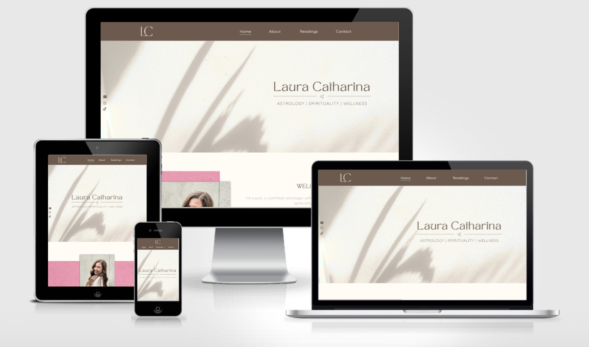
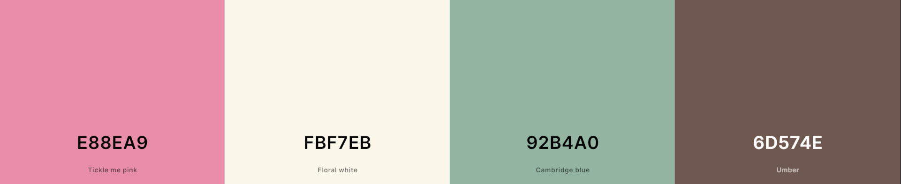
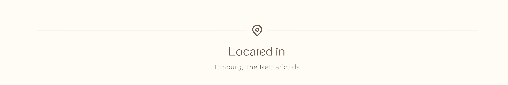
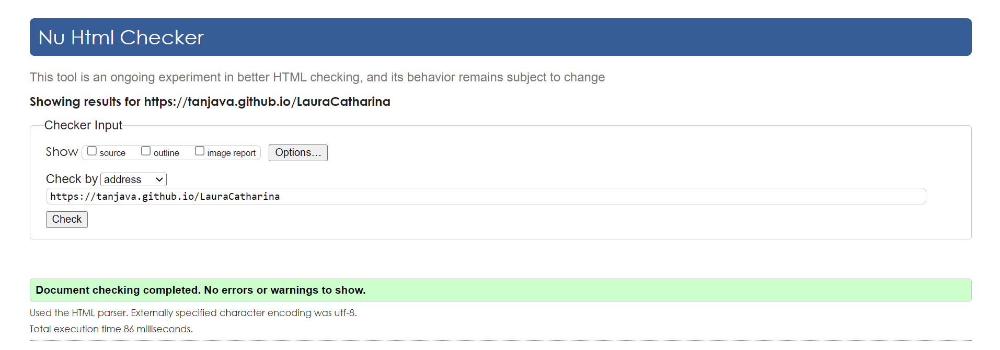
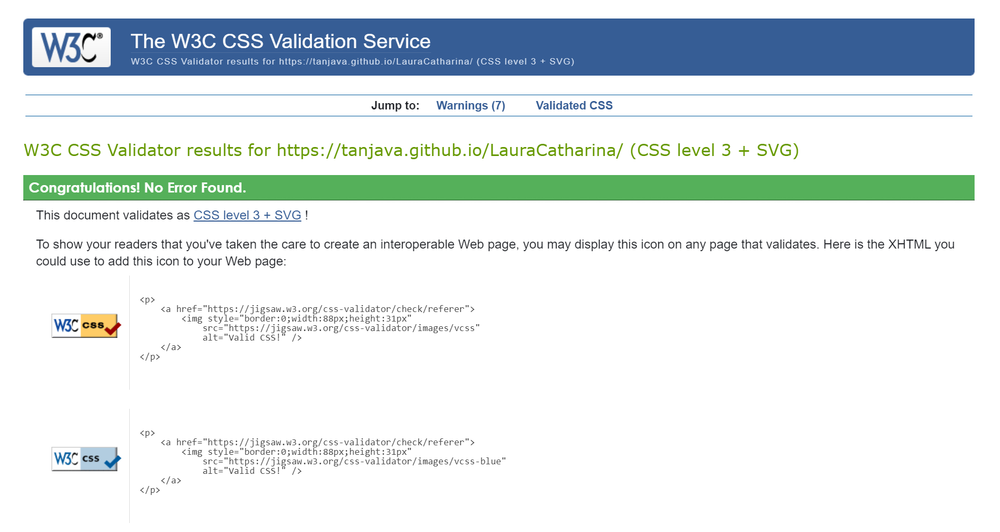
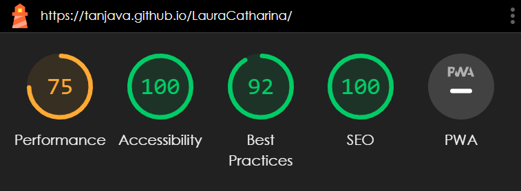

# Laura Catharina - Astrology, Spirituality and Wellness

My friend Laura Catharina is a certified astrologist and she inspired me to develop this personal website that focuses on astrology, spirituality and wellness, and where people can request the personalized astrology readings that she offers.

The live link for the site can be found here - https://tanjava.github.io/Laura-Catharina/index.html

# Table of contents
- [Design](#design)
  - [Color Scheme](#color-scheme)
  - [Typography](#typography)
  - [Images](#images)    
- [Features](#features)
  - [Existing Features](#existing-features)
    - [Languages Used](#languages-used)
    - [Navigation](#navigation)
    - [Website banner](#website-banner)
    - [Home Page](#home-page)
    - [Location](#location)
    - [Footer](#footer)
    - [About](#about)
    - [Readings](#readings)
      - [Big Three](#big-three--career--birth-chart)
      - [Career](#big-three--career--birth-chart)
      - [Birth Chart](#big-three--career--birth-chart)
    - [Contact](#contact)
  - [Future Features](#future-features)
- [Testing](#testing)
  - [Validator Testing](#validator-testing)
  - [Unfixed Bugs](#unfixed-bugs)
  - [Frameworks, Libraries & Programs Used](#frameworks-libraries-and-programs-used)
- [Deployment](#deployment)
- [Credits](#credits)
  - [Content](#content)
  - [Media](#media)

# Design

The design for the website was based on this mood board.

## Color Scheme

Based on the mood board, the following colors were chosen to capture the feel and style of the website:

## Typography

Tan Mon Cheri is a sans-serif font that has an overall light and airy feel, whereas Quicksand is a simple and clean sans-serif font. The combination of these fonts gives a minimal, clean, elegant and modern look to the site and the special dot above the lowercase letter ‘i’ of the Tan Mon Cheri font subtlety ties in with the astrology theme of the website.

## Images

The main colors of the website are brown and beige to create an overall calm and natural feel. The images add the pop of pink and green color. 

# Features

## Existing Features:

This is a seven page website with a Thank You page. 

### Languages Used

- HTML5
- CSS3

### Navigation

The navigation bar is fixed on top for easy navigation between the pages. It has a logo on the left and a main menu with four buttons (one per page) and a submenu with three buttons (one per page) on the right. The navigation bar adjusts in size as the screen size decreases. On very small screen sizes the logo positions on top of the main menu.

### Website banner

Under the header the website has a banner.  The text over the Hero Image, 'Buddha - Dharma - Sangha', has been added to break up the image and has been included to improve the design. 'Buddha - Dharma - Sangha' are the Three Jewels of Buddhism and are an important part of the teachings.

### Fixed Social Media Sidebar

A social media sidebar is positioned on the left hand side of the page with a fixed position, meaning that when the user scrolls the page, the sidebar will remain in the same position. This serves as a quick and easy way for users to:
- get in touch with the website owner by clicking on the email icon and;
- connect with the website on other platforms by clicking the Instagram/TikTok icon, increasing the reach of the website’s content and potentially driving more traffic to the website. 

This feature is hidden on devices of 580px wide and down.

### Home Page

This page is the first page users will see. It has a 'Welcome' and a 'Work With Me' section, and is designed to capture their attention and encourage themn to explore the website further.

#### Welcome

This section welcomes the user and gives a short introduction about the website owner and the website itself. 

#### Work with me

This section provides information about the services offered and invites the user to work with the website owner. The ‘go on a self-discovery journey’ button redirects the user to the Readings page where the different readings are offered with a brief description of each.  

#### Reviews

This section shows testimonials from users, highlighting their positive experiences working with the website owner and the readings received. This adds credibility to the website and helps others feel confident in working with the website owner and the readings they’ll receive.

The reviews are shown on the home page as well as the general readings page and individual readings pages (Big Three, Career and Birth Chart).

### Location

The location section was added to the website to inform people of the geographic location where the website owner is based.

### Footer

The footer contains copyright information on the left, thee social links (email, Instagram and tiktok) in the center and a web design reference on the right. 

### About

The about page tells visitors the story of the website owner. Here, They can learn more about her and be inspired to work with her.

### Readings

This page provides summarized information of the readings that are offered, allowing users to choose which reading is best suited for them depending on what they're seeking answers about. The 'Read more' button redirects the users to the specific reading page, where they can learn more about that reading and all that it entails. 

#### Big Three / Career / Birth Chart

The Big Three reading page, Career reading page & Birth Chart reading page provide more detailed information about each specific reading. This information includes:
- reading summary
- who the specific reading is for,
- why users should choose that specific reading
- what the users will receive
- what information the website owner needs from the user

### Contact 

On this page the user can fill out a form to get in contact with the website owner to request a reading or more information or to just reach out with any questions/concerns or collaboration possibilities.

After filling in the form on the Contact page the user will be redirected to a 'Thank You' page and receive confirmation that their information has been submitted and the website owner will get back in touch with them.

## Future Features

- Blog page - for everyone’s weekly dose of astrology, spirituality and wellness, and to interact with customers and build relationships.

- Shopping Cart feature – for users to purchase the personalized astrology readings directly through the website 

# Testing

Testing of the website has been conducted on a laptop using GOogle Chrome and Microsoft Edge, and mobile using Safari and Android. Google DevTools was used to test different devices and screen resolutions. 

Navigation, all of the links and the contact form  function as expected.

When I first ran my code through the W3C HTML and CSS validators some sections failed and required some minor changes. 

## Validator Testing

- HTML
  - No errors were returned when passing through the official [W3C Validator](https://validator.w3.org/nu/?doc=https%3A%2F%2Fangelicaguimaraes.github.io%2Fmagnolia_tree%2Findex.html)

- CSS
  - No errors were found when passing through the official ([Jigsaw](http://jigsaw.w3.org/css-validator/validator?lang=en&profile=css3svg&uri=https%3A%2F%2Fangelicaguimaraes.github.io%2Fmagnolia_tree%2Findex.html&usermedium=all&vextwarning=&warning=1)) validator:

- Lighthouse (Accessibility Audit)

NB: Although the above screenshots show the results of the home page, the results are the same on every other page of the website.

## Unfixed Bugs

Initially, when using the site on mobile resolution, the hoverable navigation of the Readings, and it's submenu, couldn't be accessed as the dropdown menu briefly appeared when clicking on Readings, but the navigation then immediatly reloaded and disappeared. The user would have to click Readings, hold it and then drag down to the submenu for the readings button and submenu buttons to be accessible. 

To fix this when using the site on mobile resolution, I created a clickable dropdown menu with a down arrow symbol. It still doesn't work perfectly as the user now has to click the precise down arrow target area in order to be able to use the submenu, but at least the readings button and submenu buttons are accessible this way. In case the user does not click the precise down arrow target area, they will be led to the Readings page and can always navigate to the specific readings from there. 

## Frameworks, Libraries and Programs Used

- Github: Store Repository
- Gitpod: Create HTML and CSS files
- Google Fonts: 
  - Font-family 'Quicksand'
- Font Awesome & Favicon
  - For cover text icons, location icon and Social Media icons
- Am I Responsive
  - Screenshots of the final project on all devices

# Deployment

The site was deployed to GitHub pages. The steps to deploy are as follows: 

  1. In the GitHub repository, navigate to the Settings tab. 
  2. From the settings tab, select the 'Pages' tab in the 'Code and Automation' section.
  3. In the source section, select 'Deploy from a brach' and in the branch section, select 'Main'.
  4. Once the 'Main' branch has been selected, the page will be automatically refreshed with a detailed ribbon display to indicate the successful deployment. 

The live link for the site can be found here - https://tanjava.github.io/Laura-Catharina/index.html

# Credits

Special thanks to Laura Catharina for inspiring me to make this personal website as my first project for this course.

I also want to thank the Code Institute Slack community for their support, and my mentor Martina for her time and guidance, I really appreciate it! 

Some usefull sites that really helped me throughout my project: 
- https://stackoverflow.com
- https://www.w3schools.com/

## Content

All of the content for the Home, About, Readings (main), Big Three reading, Career reading and Birth Chart reading pages was written by Laura Catharina herself.

## Media

Images:
- Reading covers - created by Laura Catharina using [Canva](http://www.canva.com)
- Green / pink / brown image – Image by [rawpixel.com on Freepik](https://www.freepik.com/free-photo/plain-green-paper-textured_11307163.htm#query=green%20paper%20texture&position=0&from_view=keyword&track=ais) & edited to different colors.
- Shadow Leaf Minimalism Backdrop – Image by [jcsmilly on depositphotos](https://depositphotos.com/557980572/stock-photo-shdow-palm-leaf-textured-minimalism.html)
- Shadow of Leaves on White Background (review section) – Image by [Anna Tarazevich on Pexels]( https://www.pexels.com/photo/shadow-of-leaves-on-white-background-6486618/)